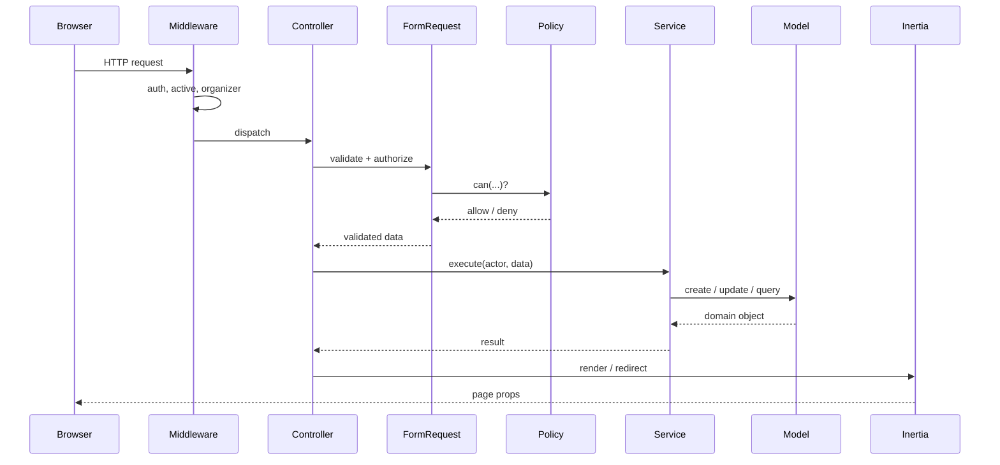
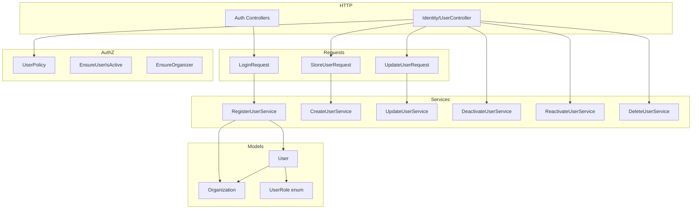
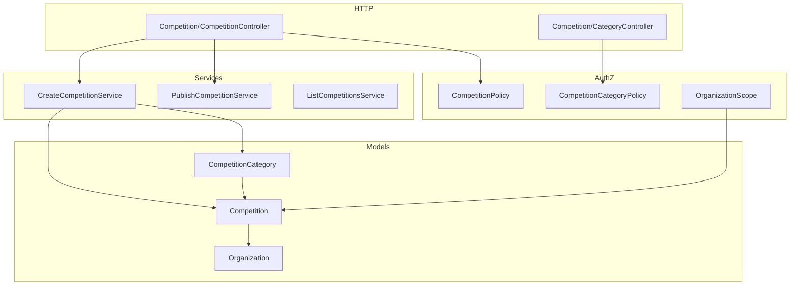

# Architecture — Competition Management System

This document explains **how the system is structured** and **why**. Coding conventions live in [../PROJECT_RULES.md](../PROJECT_RULES.md); this document covers the higher-level shape.

## 1. Architectural Style

A **modular monolith**: one deployable Laravel application, organized by **domain module** rather than by technical layer. Each module owns its controllers, requests, services, policies, and tests under a consistent folder convention.

**Why a monolith?** The domain is cohesive and the team is small. Microservices would add operational overhead without a corresponding benefit. Clear module boundaries keep the option open to extract a service later if a real need appears.

## 2. Request Lifecycle



## 3. Layer Responsibilities

| Layer | Responsibility | Rule of thumb |
|---|---|---|
| **Middleware** | Cross-cutting gates (auth, active account, role) | No business logic |
| **Controller** | Receive → authorize → delegate → respond | ≤ ~15 lines per action |
| **Form Request** | Validation + `authorize()` hook (calls Policy) | No side effects |
| **Policy** | Authorization decisions | Pure functions on `(actor, target)` |
| **Service** | Business logic orchestration | Stateless; explicit inputs; returns domain objects |
| **Model** | Persistence + relationships + casts | `$fillable`, `casts()`, scopes |
| **Event / Listener / Job** | Async & cross-cutting side effects | Jobs receive `organizationId` explicitly |

**Golden rule:** controllers never contain role checks or business logic. Authorization lives in Policies; workflows live in Services.

## 4. Folder Structure

Modules are subfolders inside each layer, keeping every artifact discoverable from its module name.

```
app/
├── Enums/                       # UserRole, (future) CompetitionStatus
├── Http/
│   ├── Controllers/{Module}/    # e.g. Identity/UserController
│   ├── Middleware/              # EnsureUserIsActive, EnsureOrganizer
│   └── Requests/{Module}/       # StoreUserRequest, UpdateUserRequest
├── Models/                      # flat: User, Organization
│   └── Scopes/                  # OrganizationScope
├── Policies/{Module}/           # Identity/UserPolicy
├── Services/{Module}/           # Identity/CreateUserService, ...
├── Jobs/{Module}/               # (future)
├── Events/{Module}/             # (future)
├── Listeners/{Module}/          # (future)
└── Notifications/{Module}/      # (future)

resources/js/
├── pages/{module}/              # pages/identity/users/{Index,Create,Edit}.vue
├── components/                  # shared + ui/ (shadcn-vue)
├── layouts/
└── types/                       # shared TypeScript types
```

Frontend pages mirror backend modules (`pages/identity/…` ↔ `Controllers/Identity/…`).

## 5. Multi-Tenancy

- **Model:** row-level, shared database. Tenant-owned rows carry `organization_id`.
- **Users:** belong to exactly one organization; super admins have `organization_id = null`.
- **Scoping today:** tenant-scoped listings filter by `organization_id` inside services (e.g. `ListUsersService`). Super admins bypass the filter.
- **Scoping later:** an `OrganizationScope` global scope will be introduced for competition-domain models (Sprint 2+). It will **not** be applied globally to `User`, because authentication and super-admin queries must see across organizations.
- **Jobs:** must receive `organizationId` explicitly in their constructor — never read tenant context from the session.

See [DECISIONS.md](DECISIONS.md) for the reasoning behind these choices.

## 6. Authentication & Authorization

### Authentication (who you are)

- Provided by the Laravel Vue starter kit (controller-based, Breeze-style).
- Login is **workspace-scoped**: the form takes an `organization_slug`, an email, and a password. The slug resolves the organization, and credentials are matched within it.
- The reserved slug `platform` routes to super-admin authentication (`organization_id = null`, role `super-admin`).
- `EnsureUserIsActive` logs out and invalidates the session of any user whose `deactivated_at` is set.

### Authorization (what you can do)

- Enforced by **Policies**, invoked from Form Requests (`authorize()`) and controllers (`$this->authorize()`).
- `UserPolicy` encodes rules such as: cannot act on yourself for destructive actions, cannot remove the last organizer, `super-admin` role cannot be assigned through the UI, cross-tenant actions are denied.
- Frontend conditionally hides UI (e.g. the Users nav item) based on role — but **UI hiding is not security**; the backend Policy is the real gate.



## 7. Competition module (Sprint 2 — foundation in progress)

Full design: [COMPETITION_DESIGN.md](COMPETITION_DESIGN.md).



- `Competition` is the aggregate root; categories nest under it.
- `OrganizationScope` on `Competition` only — categories inherit tenancy via parent.
- `CreateCompetitionService` auto-creates default **General** category in a transaction.
- Status transitions (publish, activate, close) are explicit service actions.

## 8. Frontend Architecture

- **Inertia.js** bridges Laravel and Vue — no separate REST client for the web app; controllers return `Inertia::render(...)` with typed props.
- **Vue 3 + `<script setup lang="ts">`**, TypeScript throughout.
- **shadcn-vue (radix-vue)** primitives under `resources/js/components/ui/`.
- Shared types in `resources/js/types/` (e.g. `User`, `ManagedUser`, `PaginatedUsers`).
- Server-provided `can` props drive conditional rendering of destructive actions.

## 9. Background Work

- **Redis** backs cache, session, and the queue.
- Deferred/heavy work (leaderboard computation, exports, notifications) runs as **queued Jobs** (`ShouldQueue`), introduced from Sprint 2 onward.
- Jobs calling external APIs set `$tries` and `$backoff`.

## 10. Testing Strategy

- **Feature tests** (`tests/Feature/{Module}/`) exercise full HTTP flows including middleware, validation, and policies.
- **Unit tests** (`tests/Unit/…`) cover isolated logic such as policy decisions.
- `RefreshDatabase` for anything touching the DB; the database is never mocked in feature tests.
- Multi-tenant isolation is asserted directly (an organizer cannot see or mutate another org's users).

## 11. Deployment

- **Local development:** `php artisan serve` + `npm run dev` (or `composer dev`). Docker is **not** used locally.
- **Production:** Docker (`docker-compose.yml`, `docker/`) separates web, app, queue worker, and scheduler as distinct processes.

## Related Documents

- [PRD.md](PRD.md) — product requirements
- [DATABASE.md](DATABASE.md) — schema and relationships
- [API_GUIDELINES.md](API_GUIDELINES.md) — request/response conventions
- [DECISIONS.md](DECISIONS.md) — architectural decision records
- [../PROJECT_RULES.md](../PROJECT_RULES.md) — coding standards
- [COMPETITION_DESIGN.md](COMPETITION_DESIGN.md) — Sprint 2 competition module design
