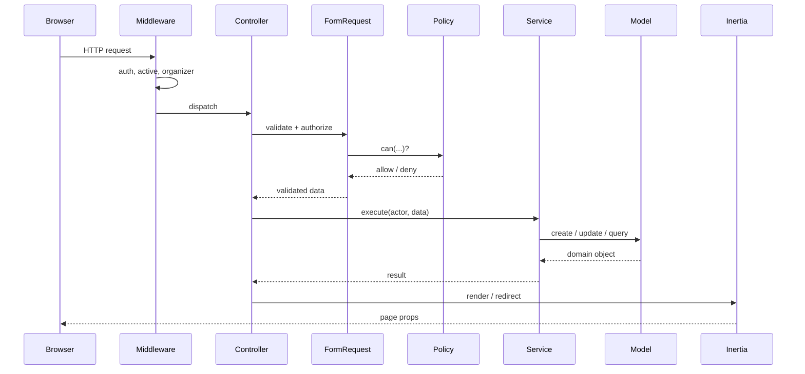
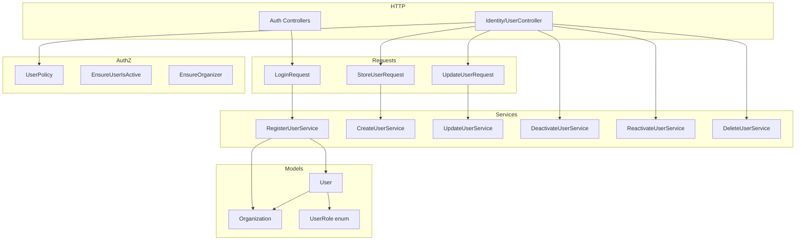

# Architecture

How the app is put together. For day-to-day coding rules, see [../PROJECT_RULES.md](../PROJECT_RULES.md).

---

## Modular monolith

One Laravel app, organized by **domain module** (Identity, Competition, etc.) rather than dumping everything in generic `Controllers/` and `Services/` folders.

A monolith was chosen because the domain is cohesive and the team is small. Microservices would add overhead with no payoff at this scale. Module boundaries are clear enough that extracting a service later remains an option if needed.

## Request flow

Every web request follows the same path:

```
Browser → Middleware → Controller → Form Request → Policy → Service → Model → Inertia
```



### What each layer does

| Layer | Job | Don't put here |
|---|---|---|
| Middleware | Gates: auth, active account, role | Business logic |
| Controller | Receive → authorize → delegate → respond | Role checks, DB queries |
| Form Request | Validation + `authorize()` | Side effects |
| Policy | Can this user do this to that resource? | Workflow logic |
| Service | Business orchestration | HTTP concerns |
| Model | Persistence, relationships, casts | Authorization |
| Job / Event | Async side effects | Session reads |

**Rule of thumb:** controllers should stay around 15 lines. If they're longer, logic has leaked in.

## Folder layout

```
app/
├── Enums/                    # UserRole, CompetitionStatus (later)
├── Http/
│   ├── Controllers/{Module}/
│   ├── Middleware/
│   └── Requests/{Module}/
├── Models/                   # flat — User, Organization, Competition...
│   └── Scopes/               # OrganizationScope (Sprint 2+)
├── Policies/{Module}/
├── Services/{Module}/
├── Jobs/{Module}/              # Sprint 2+
├── Events/{Module}/
└── Notifications/{Module}/

resources/js/
├── pages/{module}/           # mirrors backend: identity/users/Index.vue
├── components/
└── types/
```

If you know the module name, you can find every related file without a search.

## Multi-tenancy

Row-level, shared DB. Tenant-owned rows get an `organization_id`.

**Current approach (Sprint 1):** services filter by org explicitly. Example: `ListUsersService` scopes to the actor's org; super admins skip the filter.

**Planned (Sprint 2+):** `OrganizationScope` global scope on competition-domain models. Intentionally **not** on `User` — login and super-admin queries need to see across orgs.

**Jobs:** always pass `organizationId` in the constructor. Never read tenant from session inside a job.

## Auth

### Who you are (authentication)

Starter kit handles this (controller-based, Breeze-style). Login was changed to be workspace-scoped.

The form sends `organization_slug` + email + password. The slug resolves the org; credentials are matched within it. Reserved slug `platform` → super admin auth.

`EnsureUserIsActive` middleware logs out anyone with `deactivated_at` set and kills their session.

### What you can do (authorization)

Policies, always. Form Requests call `authorize()`; controllers call `$this->authorize()` where needed.

`UserPolicy` covers the edge cases encountered during Sprint 1:

- Can't deactivate/delete yourself
- Can't delete the last organizer in an org
- Can't assign `super-admin` through user management
- Cross-org access denied

The frontend hides nav items based on role (e.g. Users link only for organizers), but that's UX — the policy is the real gate.

## Identity module (what exists today)



Competition module will follow the same shape when Sprint 2 lands.

## Frontend

Inertia + Vue 3 + TypeScript. No separate REST client for the web app — controllers return `Inertia::render()` with props.

UI primitives from shadcn-vue. Shared types in `resources/js/types/`.

For destructive actions, the backend passes a `can` prop (e.g. `can.deactivate`, `can.delete`) so the UI only shows buttons the user is actually allowed to use.

## Background work

Redis for cache, session, queue. Heavy stuff (leaderboard calc, exports) will run as queued jobs from Sprint 2 onward. External API jobs get `$tries` and `$backoff`.

## Testing

- Feature tests in `tests/Feature/{Module}/` — full HTTP stack, real DB (`RefreshDatabase`)
- Unit tests for isolated logic (policies, pure service methods)
- Tenant isolation tested explicitly: organizer A cannot touch org B's users

## Deployment

Local: `composer dev` (serve + Vite + queue + logs). MySQL + Redis, not SQLite.

Production: Docker (`docker-compose.yml`). Not used locally — keeps iteration fast.

---

*Competition-domain architecture (events, jobs, scopes) gets added here when Sprint 2 ships.*
