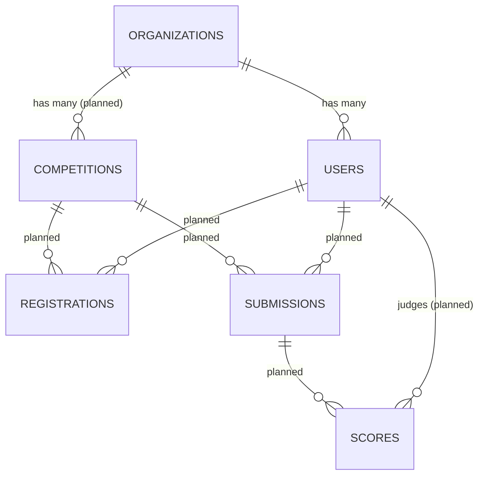

# Database — Competition Management System

This document describes the schema. It is kept in sync with the migrations in `database/migrations/`. Tables marked *(planned)* are on the roadmap and not yet migrated.

## Conventions

- Primary keys: auto-increment `id` (`bigint unsigned`).
- Timestamps: `created_at`, `updated_at` on all domain tables.
- Soft deletes: `deleted_at` where records must be recoverable.
- Tenant ownership: `organization_id` foreign key on tenant-owned tables.
- Unique constraints are **scoped per tenant** where applicable.
- Column names: `snake_case`. Enums stored as `string` columns + PHP enum casts (not native MySQL `ENUM`).

## Entity Relationship Overview

---

## Tables (implemented)

### `organizations`

The tenant root. Each organization owns its users and (future) competitions.

| Column | Type | Notes |
|---|---|---|
| `id` | bigint unsigned, PK | |
| `name` | string | Display name |
| `slug` | string, **unique** | Used at login as the workspace identifier |
| `created_at` / `updated_at` | timestamp | |
| `deleted_at` | timestamp, nullable | Soft delete; indexed |

**Indexes:** unique on `slug`; index on `deleted_at`.

**Relationships:** `hasMany(User::class)`.

---

### `users`

Extends the starter-kit users table with identity and tenancy columns.

| Column | Type | Notes |
|---|---|---|
| `id` | bigint unsigned, PK | |
| `organization_id` | bigint unsigned, FK → `organizations.id`, nullable | `null` for super admins; `nullOnDelete` |
| `name` | string | |
| `email` | string | Unique **per organization** (see below) |
| `role` | string, default `participant` | Cast to `UserRole` enum; indexed |
| `avatar_path` | string, nullable | Stored on the `public` disk |
| `email_verified_at` | timestamp, nullable | |
| `password` | string | `hashed` cast |
| `remember_token` | string, nullable | |
| `deactivated_at` | timestamp, nullable | Set → user cannot authenticate |
| `created_at` / `updated_at` | timestamp | |
| `deleted_at` | timestamp, nullable | Soft delete; indexed |

**Indexes & constraints:**

- **Composite unique** `(organization_id, email)` — replaces the default global unique on `email`.
- Index on `role`.
- Index on `deleted_at`.
- Foreign key `organization_id` → `organizations.id`, `nullOnDelete`.

**Note on per-tenant uniqueness:** MySQL allows multiple `NULL`s in a unique index, so several super admins with `organization_id = null` would not collide on the composite key. This is mitigated by only creating super admins via the seeder and by validating global uniqueness among `organization_id IS NULL` rows when needed.

**Relationships:** `belongsTo(Organization::class)`.

---

### Starter-kit support tables

| Table | Purpose |
|---|---|
| `password_reset_tokens` | Password reset flow |
| `sessions` | Database-less by default (Redis session), retained for compatibility |
| `cache`, `cache_locks` | Cache store fallback |
| `jobs`, `job_batches`, `failed_jobs` | Queue infrastructure |

---

## Tables (planned)

These reflect the roadmap; columns are indicative and will be finalized when each sprint is designed.

### `competitions` *(Sprint 2)*

| Column | Type | Notes |
|---|---|---|
| `id` | bigint unsigned, PK | |
| `organization_id` | FK → `organizations.id` | Tenant owner |
| `name` | string | |
| `slug` | string | Unique per organization |
| `description` | text, nullable | |
| `status` | string | `CompetitionStatus` enum: draft/published/active/closed |
| `starts_at` / `ends_at` | timestamp, nullable | |
| timestamps + `deleted_at` | | |

### `registrations` *(Sprint 3)*

Links a user (or team) to a competition, with a status and deadline/capacity enforcement.

### `teams` *(Sprint 3)*

Optional grouping of participants within a competition.

### `submissions` *(Sprint 4)*

Participant work: title, description, files/links, finalized state, deadline enforcement.

### `rubrics` / `rubric_criteria` *(Sprint 5)*

Scoring structure for a competition.

### `scores` *(Sprint 5)*

A judge's score for a submission against a criterion; a judge cannot score their own submission.

---

## Migrations

| Migration | Creates / Alters |
|---|---|
| `0001_01_01_000000_create_users_table` | `users`, `password_reset_tokens`, `sessions` |
| `0001_01_01_000001_create_cache_table` | `cache`, `cache_locks` |
| `0001_01_01_000002_create_jobs_table` | `jobs`, `job_batches`, `failed_jobs` |
| `2026_07_03_000001_create_organizations_table` | `organizations` |
| `2026_07_03_000002_add_identity_columns_to_users_table` | Adds tenancy/identity columns to `users` |

## Seed Data

`SuperAdminSeeder` creates a single platform administrator:

- Email: `admin@example.com`
- Password: `password`
- Role: `super-admin`
- `organization_id`: `null`

Run with `php artisan migrate --seed`. These are local development credentials only — never used in production.

## Related Documents

- [ARCHITECTURE.md](ARCHITECTURE.md) — how tenancy and scoping work
- [DECISIONS.md](DECISIONS.md) — why per-tenant email uniqueness and enum-based roles
