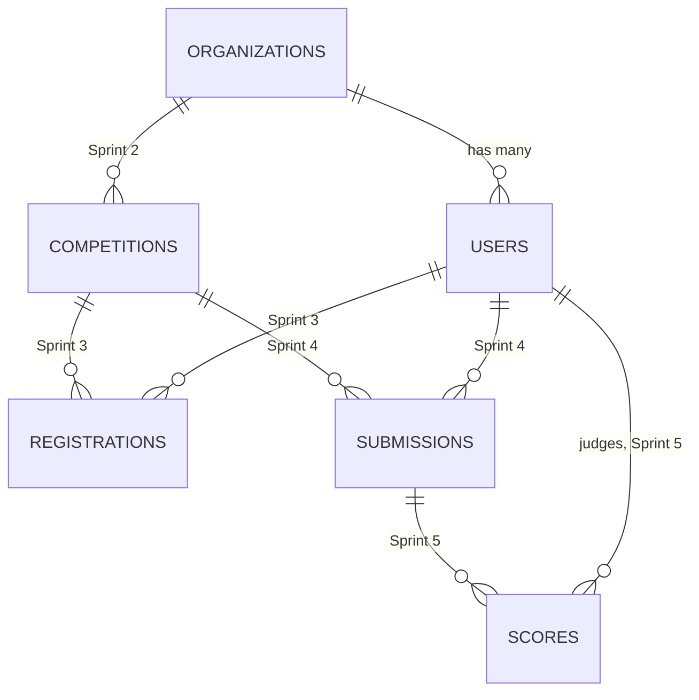

# Database

Schema reference. Synced with `database/migrations/` — if the migration and this doc disagree, the migration wins.

Planned tables are listed at the bottom with their target sprint. Full specs are added when each sprint starts.

---

## Conventions

- `id` — bigint unsigned PK, auto-increment
- `created_at` / `updated_at` on everything
- `deleted_at` where records should be recoverable (soft deletes)
- `organization_id` FK on tenant-owned tables
- Unique constraints scoped per tenant where it makes sense
- Enums as `string` columns + PHP enum cast — not MySQL `ENUM` type

## Relationships (current + planned)

---

## Implemented tables

### `organizations`

Tenant root. Owns users now; will own competitions from Sprint 2.

| Column | Type | Notes |
|---|---|---|
| `id` | bigint, PK | |
| `name` | string | |
| `slug` | string, unique | Login workspace identifier |
| `created_at` / `updated_at` | timestamp | |
| `deleted_at` | timestamp, nullable | Indexed |

`hasMany(User)`. Will `hasMany(Competition)` later.

---

### `users`

Starter-kit table extended for tenancy and identity.

| Column | Type | Notes |
|---|---|---|
| `id` | bigint, PK | |
| `organization_id` | FK → organizations, nullable | `null` = super admin. `nullOnDelete`. |
| `name` | string | |
| `email` | string | Unique per org (see below) |
| `role` | string, default `participant` | Cast to `UserRole` enum |
| `avatar_path` | string, nullable | Public disk |
| `email_verified_at` | timestamp, nullable | |
| `password` | string | `hashed` cast |
| `remember_token` | string, nullable | |
| `deactivated_at` | timestamp, nullable | Blocks login when set |
| `created_at` / `updated_at` | timestamp | |
| `deleted_at` | timestamp, nullable | Soft delete |

**Constraints:**

- `unique(organization_id, email)` — replaced the global unique on email
- Index on `role`, `deleted_at`

**Gotcha:** MySQL treats `NULL` as distinct in unique indexes, so multiple super admins (`organization_id = null`) won't collide. Super admins are created only via the seeder — no UI for it. If a second super admin is ever needed, a validation rule for global email uniqueness among `organization_id IS NULL` rows should be added.

`belongsTo(Organization)`.

---

### Framework tables (from starter kit)

| Table | Purpose |
|---|---|
| `password_reset_tokens` | Password reset |
| `sessions` | Kept for compatibility; sessions actually live in Redis |
| `cache`, `cache_locks` | Cache fallback |
| `jobs`, `job_batches`, `failed_jobs` | Queue infrastructure |

---

## Planned tables

Rough shape — columns get finalized when each sprint starts.

### `competitions` — Sprint 2

Org-scoped. `name`, `slug` (unique per org), `description`, `status` (enum), `starts_at`, `ends_at`, soft deletes.

### `registrations` — Sprint 3

User or team ↔ competition. Status, deadline/capacity checks.

### `teams` — Sprint 3

Optional participant grouping within a competition.

### `submissions` — Sprint 4

Participant work. Title, description, files/links, finalized flag.

### `rubrics` / `rubric_criteria` — Sprint 5

Scoring structure per competition.

### `scores` — Sprint 5

Judge × submission × criterion. Self-scoring blocked in policy.

---

## Migrations

| File | What it does |
|---|---|
| `0001_01_01_000000_create_users_table` | users, password_reset_tokens, sessions |
| `0001_01_01_000001_create_cache_table` | cache tables |
| `0001_01_01_000002_create_jobs_table` | queue tables |
| `2026_07_03_000001_create_organizations_table` | organizations |
| `2026_07_03_000002_add_identity_columns_to_users_table` | tenancy + identity on users |

## Seed data

`SuperAdminSeeder` — local dev only:

| Field | Value |
|---|---|
| Email | `admin@example.com` |
| Password | `password` |
| Role | `super-admin` |
| Workspace | `platform` |

Run: `php artisan migrate --seed`

---

*Planned table sections get replaced with full column specs when their sprint ships.*
