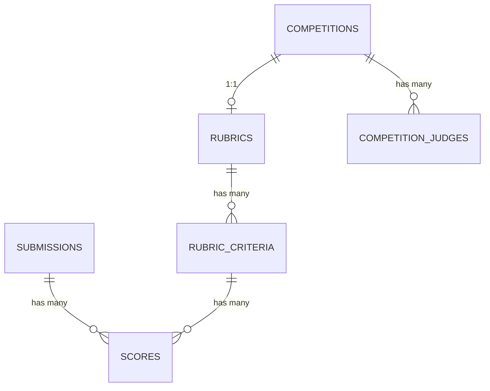

# Judging Module — Design Document

## Domain summary

Sprint 6 answers *how good was it*. A `Judge`-role user, once assigned to a competition, scores every **finalized** submission in that competition against the competition's rubric — one independent score per criterion, never averaged with other judges' scores this sprint. A judge can never score a submission belonging to their own registration or a team they actively belong to.

Aggregation, weighting, and rank computation are **out of scope** — that is Sprint 7 (Leaderboard & Results), which will read `scores` without needing a schema change.

## Rubric

Every competition gets an empty `Rubric` the moment it's created — the same auto-provisioning `CreateCompetitionService` already does for the default "General" category (ADR-0015, extended by ADR-0027). Organizers only ever manage `RubricCriterion` rows (`name`, optional `description`, `max_score`, `sort_order`); there is no separate "create a rubric" step. Every criterion's floor is `0` — only the ceiling (`max_score`) is configurable.

## Judge assignment

`CompetitionJudge` (`competition_judges` table) links a `User` (must have the `Judge` role) to a `Competition`, with a `status` (`active`/`removed`) — a structural copy of `TeamMember`. Only users already assigned and `active` may score submissions in that competition. Assignment is organizer-managed, from existing org users with the Judge role — no invite flow, mirroring how coaches were assigned in Sprint 3.

## Scoring

`Score` rows are `(submission_id, rubric_criterion_id, judge_id, score, comment)`, unique per triple. A judge submits a **full scorecard** — every criterion for one submission — in a single upsert action, mirroring `UpsertSubmissionService`'s style. Scores remain editable by the judge until the competition is `closed` (`Competition::isClosed()` — no separate scoring-lock flag).

### Eligibility to score a submission

All of the following must hold (`ScorePolicy::manage`):

1. The submission is `finalized` (drafts are never visible to judges).
2. The competition is not `closed`.
3. The actor holds an `active` `CompetitionJudge` assignment for that submission's competition.
4. The actor is **not** the submission's individual registrant, and **not** an active member of the registrant team — the exact `isOwnerOrActiveMember` check already duplicated in `RegistrationPolicy`/`SubmissionPolicy`, inverted here.

## Database design

### `competition_judges`

| Column | Type | Notes |
|---|---|---|
| `id` | bigint unsigned, PK | |
| `competition_id` | FK → `competitions.id` | Cascade on delete |
| `user_id` | FK → `users.id` | Cascade on delete |
| `status` | string, default `active` | `CompetitionJudgeStatus` |
| timestamps | | |

**Unique:** `(competition_id, user_id)`. **Tenancy:** `CompetitionOrganizationScope`, reused directly — it already accepts a configurable FK name and defaults to `competition_id`, which this table has.

### `rubrics`

`id`, `competition_id` (FK, **unique** — 1:1), timestamps. Same scope reuse as `competition_judges`.

### `rubric_criteria`

`id`, `rubric_id` (FK), `name`, `description` (nullable), `max_score` (unsigned small int), `sort_order`, timestamps. No scope of its own — resolved via its parent `rubric`/`competition`, same posture as `competition_categories`.

### `scores`

`id`, `submission_id` (FK), `rubric_criterion_id` (FK), `judge_id` (FK → `users.id`), `score` (unsigned small int), `comment` (nullable), timestamps. Unique `(submission_id, rubric_criterion_id, judge_id)`. **Tenancy:** new `ScoreOrganizationScope` — one hop past `SubmissionOrganizationScope` (adds a `submissions` join in front of the existing `registrations → competition_categories → competitions` chain).

## Model responsibilities

- **`CompetitionJudge`**: `belongsTo` Competition/User, `isActive()`.
- **`Rubric`**: `belongsTo` Competition, `hasMany` `RubricCriterion` (ordered by `sort_order`).
- **`RubricCriterion`**: `belongsTo` Rubric.
- **`Score`**: `belongsTo` Submission, `belongsTo` RubricCriterion (as `criterion`), `belongsTo` User (as `judge`, via `judge_id`).
- **`User`**: gains `isJudge()`, matching the existing `isSuperAdmin()`/`isOrganizer()` convention.

## Authorization

| Policy | Ability | Rule |
|---|---|---|
| `CompetitionJudgePolicy` | `manage(actor, competition)` | Organizer of the competition's org, or super admin |
| `RubricPolicy` | `manageCriteria(actor, competition)` | Same as above |
| `RubricPolicy` | `view(actor, competition)` | Organizer/super admin, **or** an actively-assigned judge (needs to see max scores while scoring) |
| `ScorePolicy` | `manage(actor, submission)` | See "Eligibility to score a submission" above |
| `ScorePolicy` | `viewAny(actor, competition)` | Organizer/super admin — read-only oversight, same posture as `RegistrationPolicy`/`SubmissionPolicy` |

Note: policy calls that pass a `Competition`/`Submission` instance as the *ability subject* but need to resolve a *different* policy class use the established `[MarkerClass::class, ...args]` array convention (e.g. `$actor->can('manage', [Score::class, $submission])`) — otherwise Laravel would resolve `SubmissionPolicy` (registered for `Submission`) or `CompetitionPolicy` (registered for `Competition`) instead of the intended judging policy.

## Services

- **`AssignJudgeService` / `RemoveJudgeService` / `ListOrganizationJudgesService`** — mirror `AssignCoachService`/`RemoveCoachService`/`ListOrganizationCoachesService` from Sprint 3 exactly.
- **`CreateRubricCriterionService` / `UpdateRubricCriterionService` / `DeleteRubricCriterionService`** — mirror the category CRUD services; delete is blocked (`ValidationException`) if any `Score` already references the criterion.
- **`SubmitScoreService`** — upserts every criterion's score for one submission by one judge inside a transaction; validates each `score` against its criterion's `max_score` (`0 ≤ score ≤ max_score`).
- **`ListJudgeQueueService`** — finalized submissions across every competition the judge is actively assigned to, excluding submissions the judge themself owns/co-owns, with a per-row "scored by me" flag.
- **`ListSubmissionScoresService`** — organizer-facing, read-only, feeds a "Scores" count into the existing Submissions Review page.

## HTTP surface

### Organizer routes (`auth`, `verified`, `active`, `organizer`)

| Method | URI | Name |
|---|---|---|
| POST | `/competitions/{competition}/judges` | `competitions.judges.store` |
| DELETE | `/competitions/{competition}/judges/{judge}` | `competitions.judges.destroy` |
| POST | `/competitions/{competition}/rubric-criteria` | `competitions.rubric-criteria.store` |
| PUT | `/rubric-criteria/{criterion}` | `rubric-criteria.update` |
| DELETE | `/rubric-criteria/{criterion}` | `rubric-criteria.destroy` |

### Judge routes (`auth`, `verified`, `active`)

| Method | URI | Name |
|---|---|---|
| GET | `/judging/queue` | `judging.queue.index` |
| GET | `/submissions/{submission}/score` | `submissions.score.edit` |
| PUT | `/submissions/{submission}/score` | `submissions.score.update` |

## Testing strategy

- **Unit**: every `ScorePolicy`/`RubricPolicy`/`CompetitionJudgePolicy` ability, with particular emphasis on the self-scoring guard (individual and team-membership cases) and the finalized/closed-competition guards.
- **Feature**: assign/revoke a judge, criterion CRUD (including delete-blocked-by-existing-scores), full scorecard submit happy path, self-score denied end-to-end, unassigned judge denied, draft submission not scorable, closed competition blocks edits, out-of-range score rejected, organizer's read-only score count.

## Out of scope (Sprint 6)

- Aggregating, weighting, or ranking scores (Sprint 7 — Leaderboard).
- Blind judging infrastructure beyond "a judge only ever touches their own `Score` rows" (no separate visibility toggle).
- Per-category rubrics (ADR-0027 — one rubric per competition).
- Un-locking scores after a competition closes.

## Implementation order (GitHub Issues)

1. Foundation — migrations, enum, models, `ScoreOrganizationScope`, the three policies, `User::isJudge()`, factories, this doc + ADRs (#86).
2. Judge assignment & rubric management — services, controllers, routes, feature tests.
3. Scoring flow — `SubmitScoreService`, judge queue, organizer score-count extension, feature tests.
4. UI — judge queue + score-entry pages, organizer Judges/Rubric cards, Scores column on Submissions Review.
