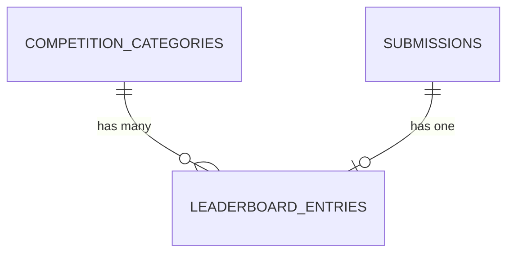

# Leaderboard Module — Design Document

## Domain summary

Sprint 7 answers *who won*. Once a competition closes, a queued job computes one ranked leaderboard per category from the `scores` recorded in Sprint 6, and the result becomes visible on the public event page. This is the last MVP sprint — it closes the product lifecycle `create → publish → register → submit → judge → rank`.

## Trigger

Leaderboard computation happens **exactly once**, when a competition closes — there is no organizer preview or manual recalculation before that, and no recomputation after. This is deliberate: scores are frozen at close (`ScorePolicy::manage` already denies edits once `Competition::isClosed()`, per ADR-0028), so one computation is authoritative and nothing can invalidate it afterward.

`CloseCompetitionService::execute()` dispatches `App\Events\Competition\CompetitionClosed` after its `DB::transaction()` commits (mirrors the existing, currently listener-less `CompetitionPublished` event). `App\Listeners\Leaderboard\DispatchLeaderboardCalculation` (Laravel's event auto-discovery wires it — no manual provider registration, same as every other event in this app) dispatches `App\Jobs\Leaderboard\CalculateLeaderboardJob`, the project's **first real queued job**.

## Aggregation rule

For each `finalized` submission in a category: sum each judge's per-criterion scores into that judge's total, then average the per-judge totals across every judge who scored it. (Every judge submits a full scorecard per `SubmitScoreService`, so this is equivalent to, but cheaper than, averaging per-criterion then summing across criteria.) A submission with **zero scores gets no leaderboard row at all** — it does not appear, ranked or otherwise.

Ranking within a category: `aggregate_score` descending, tiebreak by `submission.submitted_at` ascending (earlier submission wins). Ranks are sequential integers (1, 2, 3, ...) — no shared/tied rank numbers.

## Database design

### `leaderboard_entries`

| Column | Type | Notes |
|---|---|---|
| `id` | bigint unsigned, PK | |
| `competition_category_id` | FK → `competition_categories.id` | Cascade on delete |
| `submission_id` | FK → `submissions.id` | Cascade on delete |
| `aggregate_score` | `decimal(8,2)` unsigned | Average of per-judge totals |
| `judge_count` | unsigned small int | How many judges scored this submission |
| `rank` | unsigned small int | 1-based, sequential |
| timestamps | | |

**Unique:** `(competition_category_id, submission_id)`. **Index:** `(competition_category_id, rank)` for the read path. **Tenancy:** `RegistrationOrganizationScope`, reused directly — it already accepts a configurable FK name and defaults to `competition_category_id`, which this table has (same reuse pattern Sprint 6 used for `CompetitionOrganizationScope` on `CompetitionJudge`/`Rubric`).

Recomputation replaces a category's rows wholesale (delete then bulk-insert) rather than upserting in place — simpler than reconciling stale ranks, and safe because computation only ever runs once per competition.

## Model responsibilities

- **`LeaderboardEntry`**: `belongsTo` `CompetitionCategory` (as `category`), `belongsTo` `Submission`.

## Job pipeline

- **`CalculateLeaderboardJob implements ShouldQueue`** — given a `Competition`, resolves its categories (`withoutGlobalScope(CompetitionOrganizationScope::class)`) and runs the compute service against each.
- **`CalculateCategoryLeaderboardService`** — for one `CompetitionCategory`: loads finalized submissions and their scores (`withoutGlobalScopes()` — safe because the category itself was already tenant-resolved by the job), computes `aggregate_score`/`judge_count` per submission, drops zero-score submissions, sorts, and replaces the category's `leaderboard_entries` rows inside a transaction.

Neither the job nor the service uses the `background_mode` container flag present (but never bound) in every existing org-scope class — that hook is unused and unverified anywhere in the app. Instead, both follow the same explicit `withoutGlobalScope(...)`/`withoutGlobalScopes()` bypass already proven throughout the codebase (`ShowPublicCompetitionService`, `ListSubmissionsService`, judging policies).

## Read side (public page)

**`ShowPublicLeaderboardService`** — same guest-access resolution chain as `ShowPublicCompetitionService`: resolve `Organization` by slug, resolve `Competition` via `withoutGlobalScope(OrganizationScope::class)`, `abort(404)` unless `Competition::isClosed()`. Loads each category's entries with `submission.registration.user`/`.team` eager-loaded, and reuses the existing registrant display-name expression (`$registration->team?->name ?? $registration->user?->name`, already used in `SubmissionController`) rather than re-deriving it.

No new Policy this sprint — the route is public, gated purely by `isClosed()`, and there are no write actions.

## HTTP surface

### Public route (guest-accessible)

| Method | URI | Name |
|---|---|---|
| GET | `/events/{organization}/{competition}/leaderboard` | `events.competitions.leaderboard` |

Organizer access to the same data is via a link to this same public route from the competition Edit page (once closed) — no separate organizer-only leaderboard view.

## Testing strategy

- **Unit**: `CalculateCategoryLeaderboardService` — rank ordering, tiebreak by `submitted_at`, zero-score exclusion, aggregate math with differing judge counts per submission.
- **Feature**: closing a competition dispatches the job and produces correct `leaderboard_entries` rows end-to-end; public route 404s before close and returns correct ranked data after; cross-organization competition slugs 404 (same posture as `ShowPublicCompetitionService`).

## Out of scope (Sprint 7)

- Results export / CSV (`ROADMAP.md` marks this explicitly optional).
- Organizer preview or manual recalculation before close.
- Per-criterion score breakdown on the public page — aggregate score and judge count only, to avoid exposing individual judge scoring publicly.
- Any further reaction to `CompetitionClosed` beyond the leaderboard job (e.g. notifications).

## Implementation order (GitHub Issues)

1. Foundation — migration, `LeaderboardEntry` model, `CompetitionClosed` event wired into `CloseCompetitionService`, this doc + ADR-0029 (#94).
2. Calculation — `CalculateLeaderboardJob`, listener, `CalculateCategoryLeaderboardService`, unit + feature tests.
3. Public page backend — `ShowPublicLeaderboardService`, `PublicLeaderboardController`, route, feature tests.
4. UI — public leaderboard page, links from the public competition page and organizer Competition Edit, docs closed out.
