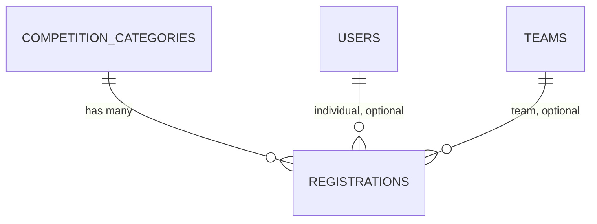

# Registration Module — Design Document

## Domain summary

Sprint 4 answers *what category is a participant or team actually competing in*. Sprint 3 built teams and eligibility checkers but deliberately stopped short of a `registrations` table (see `TEAM_PARTICIPANT_DESIGN.md`, "Out of scope"). This sprint:

- Introduces `registrations`: a slot linking either an individual `user_id` **or** an approved `team_id` (never both) to one `competition_category_id`.
- Enforces the category's effective registration deadline and capacity, inheriting from the competition when the category has no override (ADR-0012 resolver, finally implemented — `EffectiveCategoryConfig`).
- Sends the project's first Notification on successful registration.

Registration is **instant**, not a queue: given eligibility + open deadline + free capacity, it succeeds immediately with status `confirmed`. There is no second organizer approval step — team approval already happened in Sprint 3 (ADR-0021).

## Status enum

### `RegistrationStatus`

| Value | Meaning |
|---|---|
| `confirmed` | Active registration; counts against category capacity |
| `withdrawn` | Participant/captain withdrew; frees the slot, row kept for history |

No `pending` state — see ADR-0024.

## Capacity & deadline resolution

`App\Services\Registration\EffectiveCategoryConfig::for(CompetitionCategory $category)`:

- `maxParticipants` = `category.max_participants ?? competition.max_participants`
- `registrationStartsAt` = `competition.registration_starts_at` (no category-level override exists in the schema)
- `registrationEndsAt` = `category.registration_ends_at ?? competition.registration_ends_at`
- `isRegistrationOpen(now)` — `false` if `now` is outside `[registrationStartsAt, registrationEndsAt]` (either bound optional)
- `hasCapacity(currentConfirmedCount)` — `true` if `maxParticipants` is `null`, else `currentConfirmedCount < maxParticipants`

Capacity is **slot-based**: one confirmed registration (individual or team, any roster size) = one slot (ADR-0023).

## Database design

### `registrations`

| Column | Type | Notes |
|---|---|---|
| `id` | bigint unsigned, PK | |
| `competition_category_id` | FK → `competition_categories.id` | Cascade on delete |
| `user_id` | FK → `users.id`, nullable | Individual registration |
| `team_id` | FK → `teams.id`, nullable | Team registration |
| `status` | string, indexed | `RegistrationStatus` |
| `withdrawn_at` | timestamp, nullable | |
| `created_at` / `updated_at` | timestamp | `created_at` is the confirmation moment |

**Indexes:** unique `(competition_category_id, user_id)`; unique `(competition_category_id, team_id)`.
**Tenancy:** no `organization_id` column — `RegistrationOrganizationScope` resolves it via `competition_category_id → competition_categories.competition_id → competitions.organization_id` (two-hop `whereExists`, same shape as `CompetitionOrganizationScope`).
**Invariant "exactly one of `user_id`/`team_id`":** enforced in the register services, not a DB `CHECK` — the test suite runs SQLite, dev/prod run MySQL, and Laravel's schema builder has no cross-driver `check()` helper (ADR-0023).

## Model responsibilities

### `Registration`

- `belongsTo` `CompetitionCategory` (as `category`), `User`, `Team`.
- `isConfirmed()`, `isWithdrawn()`, `isIndividual()`, `isTeam()`.
- Global scope: `RegistrationOrganizationScope`.

### `CompetitionCategory` / `Competition` (unchanged)

No new columns. `EffectiveCategoryConfig` reads existing `max_participants`/`registration_starts_at`/`registration_ends_at` on both.

## Authorization

### `RegistrationPolicy`

| Ability | Rule |
|---|---|
| `createIndividual(actor, category)` | Competition allows individual mode, not draft/closed, category active, actor is a participant in the competition's org (or super admin) |
| `createForTeam(actor, team, category)` | Team belongs to the category's competition, competition allows team mode, not draft/closed, category active, team approved, actor is the team's captain (or super admin) |
| `view(actor, registration)` | Super admin, organizer of the owning competition, the registrant, or an active member of the registered team |
| `viewAny(actor, competition)` | Organizer/super admin of the competition's org (read-only oversight) |
| `withdraw(actor, registration)` | Registration confirmed, actor is the registrant, the team captain, or super admin |

Detailed eligibility (deactivated account, wrong org, already on another team, etc.) is **not** re-derived in the policy — it is answered by the existing `CheckParticipantEligibilityService`/`CheckTeamEligibilityService` inside the register services. The policy answers "can this actor attempt the action at all"; the service answers "does the current state allow it to succeed".

## Services

### `RegisterParticipantService::execute(User $actor, CompetitionCategory $category): Registration`

1. `Gate`-equivalent check: `$actor->can('createIndividual', $category)` (defense in depth, mirrors `CreateTeamService`).
2. Run `CheckParticipantEligibilityService` → if ineligible, `ValidationException::withMessages(['category' => $reasons])`.
3. Resolve `EffectiveCategoryConfig::for($category)`; reject if deadline closed or (within a transaction, locked count) capacity full.
4. Reject if the actor already holds an active registration in this competition (any category).
5. `DB::transaction`: create `Registration` (`status: confirmed`), dispatch `RegistrationConfirmed` notification to the actor.

### `RegisterTeamService::execute(User $actor, Team $team, CompetitionCategory $category): Registration`

Same shape, using `CheckTeamEligibilityService`; the "already registered" check is per-team (a team is scoped to one competition already, per ADR-0017); notification goes to every active team member.

### `WithdrawRegistrationService::execute(User $actor, Registration $registration): Registration`

Policy-gated; sets `status = withdrawn`, `withdrawn_at = now()`. Frees the capacity slot for subsequent registrations.

### `ListRegistrationsService` (organizer, per category) / `ListParticipantRegistrationsService` (participant, own)

Read-only listing services, following `ListTeamsService`'s shape.

## Validation strategy

### Form Requests

| Request | Rule highlights |
|---|---|
| `StoreIndividualRegistrationRequest` | `authorize()`: `$this->user()->can('createIndividual', $category)`. `competition_category_id` required, must belong to the route's competition. |
| `StoreTeamRegistrationRequest` | `authorize()`: `$this->user()->can('createForTeam', [$team, $category])`. Same category-belongs-to-competition rule. |

### Service-level invariants (not expressible as simple validation rules)

- Deadline open (`EffectiveCategoryConfig::isRegistrationOpen`).
- Capacity free (`EffectiveCategoryConfig::hasCapacity`, counted under the transaction to avoid a capacity race between two concurrent registrations).
- No existing active registration for this user/team in the competition (cross-category — DB unique index only covers the same category).

## HTTP surface

### Participant routes (middleware: `auth`, `verified`, `active`)

| Method | URI | Name |
|---|---|---|
| POST | `/competitions/{competition}/registrations` | `competitions.registrations.store` |
| POST | `/teams/{team}/registrations` | `teams.registrations.store` |
| GET | `/registrations` | `registrations.index` |
| GET | `/registrations/{registration}` | `registrations.show` |
| PATCH | `/registrations/{registration}/withdraw` | `registrations.withdraw` |

### Organizer routes (middleware: `auth`, `verified`, `active`, `organizer`)

| Method | URI | Name |
|---|---|---|
| GET | `/competitions/{competition}/categories/{category}/registrations` | `competitions.categories.registrations.index` |

State-transition action (`withdraw`) uses `PATCH`, matching `competitions.php`'s convention (deliberately chosen — Sprint 3's `teams.php` used `POST` for similar actions, an inconsistency this sprint does not repeat).

## Notification

`App\Notifications\Registration\RegistrationConfirmed` — `database` channel only (ADR-0024; no mail infra yet). Payload: category name, competition name, registrant type (individual/team). Sent to the user (individual) or every active team member (team).

## Testing strategy

### Unit tests

- `EffectiveCategoryConfig`: inheritance resolution, deadline window, capacity check.
- `RegistrationPolicy`: every ability, positive and negative.

### Feature tests

- Solo register happy path; team register by captain happy path.
- Deadline closed blocks registration.
- Capacity full blocks registration (slot-based: a 5-person team still consumes 1 slot).
- Duplicate registration into the same category blocked (DB unique index surfaces as a validation error).
- Second active registration into a different category of the same competition blocked (service-level check).
- Withdraw frees a slot for a subsequent registration.
- Authorization negative cases: non-captain cannot register a team, wrong-org actor blocked, unapproved team blocked.
- `RegistrationConfirmed` notification is recorded for the individual and for all active team members.

## Out of scope (Sprint 4)

- Organizer-initiated cancellation of a participant's/team's registration (read-only oversight only this sprint).
- Waitlisting once capacity is full (registration is simply rejected).
- Email delivery of the confirmation (database channel only — see ADR-0024).
- Submissions, judging, payments (Sprint 5+).

## Implementation order (GitHub Issues)

1. Foundation — migration, enum, model, scope, `EffectiveCategoryConfig`, policy, factory, this doc + ADRs (#72).
2. Registration flow — services, controller, form requests, routes, feature tests.
3. Notification — `notifications` table, `RegistrationConfirmed`, wired into the register services.
4. UI — participant "My Registrations", organizer per-category review list, Register CTA on existing pages.
