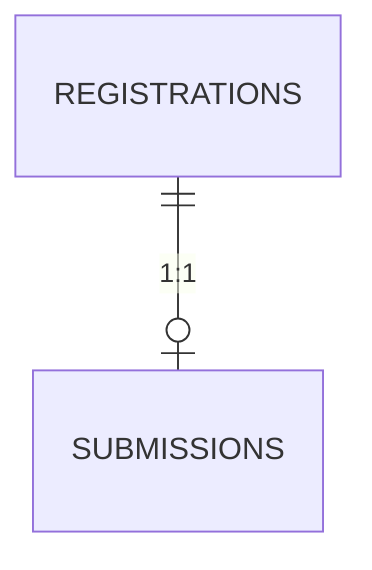

# Submission Module — Design Document

## Domain summary

Sprint 5 answers *what did a confirmed registrant actually build*. Every `registration` (individual or team entry, Sprint 4) can hold exactly one `submission`: title, description, an optional external link (repo/demo), and an optional file. Submissions start as `draft` (freely editable by the registrant or, for a team, any active member) and are `finalize`d once — a one-way lock ahead of judging (Sprint 6).

Submission timing (open/close windows) reuses the same inherit-with-override mechanism as registration deadlines — extended onto the existing `EffectiveCategoryConfig` resolver rather than a parallel class (ADR-0026).

## Status enum

### `SubmissionStatus`

| Value | Meaning |
|---|---|
| `draft` | Editable — title/description/link/file can all change |
| `finalized` | Locked — no further edits or file replacement; ready for judging |

No `pending`/review state — finalizing is entirely the registrant's call, subject only to the deadline and a "not empty" guard. No un-finalize in this sprint (organizer-initiated revert is a deferred gap, same posture as Sprint 4's registration boundary).

## Deadline resolution

`EffectiveCategoryConfig` (already resolves registration timing/capacity — `app/Services/Registration/EffectiveCategoryConfig.php`) gains:

- `submissionStartsAt` = `competition.submission_starts_at` (no category-level override, mirroring `registrationStartsAt`'s asymmetry)
- `submissionEndsAt` = `category.submission_ends_at ?? competition.submission_ends_at`
- `isSubmissionOpen(now)` — `false` if `now` is outside `[submissionStartsAt, submissionEndsAt]` (either bound optional)

## Database design

### `submissions`

| Column | Type | Notes |
|---|---|---|
| `id` | bigint unsigned, PK | |
| `registration_id` | FK → `registrations.id`, **unique** | Cascade on delete — 1:1 |
| `title` | string | |
| `description` | text, nullable | |
| `project_url` | string, nullable | Repo/demo link |
| `file_path` | string, nullable | Path on the `local` (private) disk |
| `file_original_name` | string, nullable | Display + download filename |
| `status` | string, indexed | `SubmissionStatus` |
| `submitted_at` | timestamp, nullable | Set on finalize |
| `created_at` / `updated_at` | timestamp | |

**Tenancy:** no `organization_id` column — `SubmissionOrganizationScope` resolves it via a three-hop `whereExists` (`submissions.registration_id → registrations.competition_category_id → competition_categories.competition_id → competitions.organization_id`), the same escape hatches as `RegistrationOrganizationScope` (background-mode bypass, guest → deny-all, super admin bypass, null-org → deny-all) with one extra join.
**Files:** stored on the `local` disk (private — not the `public` disk used for avatars), because submission content may be graded/sensitive work. Served only via an authenticated, policy-checked download route — never a direct/public URL (ADR-0026).

## Model responsibilities

### `Submission`

- `belongsTo` `Registration`.
- `isDraft()`, `isFinalized()`, `hasFile()`.
- Global scope: `SubmissionOrganizationScope`.

### `Competition` / `CompetitionCategory` (extend)

New columns only (`submission_starts_at`/`submission_ends_at` on `Competition`; `submission_ends_at` override on `CompetitionCategory`) — no new relations or behavior beyond what `EffectiveCategoryConfig` already provides.

## Authorization

### `SubmissionPolicy`

| Ability | Rule |
|---|---|
| `manage(actor, registration)` | Registration confirmed, competition not draft/closed, actor is the individual registrant or an **active member of the team** (any role — not just captain) |
| `update(actor, submission)` | Submission is `draft`, same ownership resolved via `submission->registration` |
| `finalize(actor, submission)` | Same as `update` |
| `view(actor, submission)` | Super admin, organizer of the owning competition's org, or owner/active team member (any status) |
| `viewAny(actor, competition)` | Organizer/super admin of the competition's org (read-only oversight, same as `RegistrationPolicy::viewAny`) |

`manage` answers "can this actor even attempt to create/open the submission form for this registration" (used to gate the edit page); `update`/`finalize` answer the same ownership question once a `Submission` row exists, gated additionally by draft status. Deadline and "not empty" checks are **service-level** (`FinalizeSubmissionService`), not policy — same split as Sprint 4's registration flow.

## Services

### `UpsertSubmissionService::execute(User $actor, Registration $registration, array $data): Submission`

1. `$actor->can('manage', [Submission::class, $registration])` (defense in depth, mirrors `CreateTeamService`/`RegisterParticipantService`).
2. If a submission already exists and is `finalized`, reject with `ValidationException`.
3. `Submission::updateOrCreate(['registration_id' => $registration->id], ['title' => ..., 'description' => ..., 'project_url' => ..., 'status' => SubmissionStatus::Draft])`.

### `UploadSubmissionFileService::execute(User $actor, Submission $submission, UploadedFile $file): Submission`

Mirrors `UploadAvatarService`: reject if not draft or not authorized; `$file->store('submissions/{registration_id}', 'local')`; update `file_path`/`file_original_name`; delete the previous file (if any) **after** the new one is stored, so a failed store never orphans the old file.

### `FinalizeSubmissionService::execute(User $actor, Submission $submission): Submission`

1. Policy check (`finalize`).
2. `EffectiveCategoryConfig::for($category)->isSubmissionOpen(now())` — reject if the window is closed.
3. Reject if the submission has no `title`... plus no `description`, `project_url`, **and** no file (an all-empty submission cannot be finalized).
4. `DB::transaction`: `status = Finalized`, `submitted_at = now()`.

### `ListSubmissionsService(competitionCategory): Collection` (organizer, read-only)

Mirrors `ListRegistrationsService` — lists submissions for a category, eager-loading `registration.user`/`registration.team`.

## Validation strategy

### Form Requests

| Request | Rule highlights |
|---|---|
| `UpsertSubmissionRequest` | `authorize()`: `$this->user()->can('manage', [Submission::class, $registration])`. `title` required, `description`/`project_url` optional (`project_url` validated as `url`). |
| `UploadSubmissionFileRequest` | `authorize()`: `$this->user()->can('update', $submission)`. `file`: required, `mimes:zip,pdf,doc,docx`, `max:20480` (20 MB). |

### Service-level invariants

- Deadline open (`EffectiveCategoryConfig::isSubmissionOpen`) — checked on finalize.
- Not-empty content required to finalize.
- Editing/uploading blocked once `finalized` (enforced by policy's `isDraft()` guard, defense-in-depth repeated in the service).

## HTTP surface

### Participant routes (middleware: `auth`, `verified`, `active`)

| Method | URI | Name |
|---|---|---|
| GET | `/registrations/{registration}/submission` | `registrations.submission.edit` |
| PUT | `/registrations/{registration}/submission` | `registrations.submission.update` |
| POST | `/submissions/{submission}/file` | `submissions.file.store` |
| GET | `/submissions/{submission}/file` | `submissions.file.download` |
| POST | `/submissions/{submission}/finalize` | `submissions.finalize` |

### Organizer routes (middleware: `auth`, `verified`, `active`, `organizer`)

| Method | URI | Name |
|---|---|---|
| GET | `/competitions/{competition}/categories/{category}/submissions` | `competitions.categories.submissions.index` |

`finalize` uses `POST`, matching `teams.submit`'s convention for an owner-initiated, one-way transition (not `PATCH`, which this codebase reserves for admin-toggled status fields — see Sprint 4's route-verb note).

## Testing strategy

### Unit tests

- `EffectiveCategoryConfig`: submission-window inheritance and `isSubmissionOpen` (mirrors the existing registration-window tests).
- `SubmissionPolicy`: every ability, positive and negative — including "any active team member, not just captain."

### Feature tests

- Create/edit a draft submission; upsert overwrites in place.
- File upload and replace (old file deleted).
- Finalize happy path; finalize blocked after the deadline; finalize blocked when the submission is empty.
- Edit/upload blocked once finalized.
- A non-captain active team member can manage the team's submission.
- Authorization negative cases: non-member, wrong-org, unconfirmed/withdrawn registration.
- Download requires the `view` ability; unauthorized users get denied, not a working link.

## Out of scope (Sprint 5)

- Un-finalizing a submission (organizer or participant) — read-only oversight this sprint, same as Sprint 4.
- Multiple files per submission / file versioning — one optional file, replaced in place.
- Judging, rubrics, scoring (Sprint 6).

## Implementation order (GitHub Issues)

1. Foundation — migrations, enum, model, scope, `EffectiveCategoryConfig` extension, policy, factory, this doc + ADRs (#80).
2. Submission flow — services, controller, form requests, routes, feature tests.
3. UI — participant submission edit page, organizer per-category review list, links from My Registrations and the competition Edit page.
